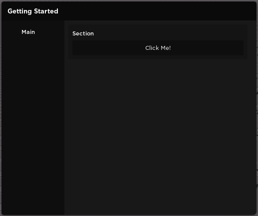

# Getting Started

## Loading the Library

Load the library from the Github repo using `loadstring` and `game:HttpGet`

```lua
local Venyx = loadstring(game:HttpGet("https://raw.githubusercontent.com/Stefanuk12/Venyx-UI-Library/main/source.lua"))()
```

## Creating a new UI

Create a new UI using the `Venyx.new` function:

```lua
local Venyx = loadstring(game:HttpGet("https://raw.githubusercontent.com/Stefanuk12/Venyx-UI-Library/main/source.lua"))()

local UI = Venyx.new("Getting Started")
```

!!! Tip
    Store the result of `Venyx.new()` in a variable so you can add pages to it later
## Creating a Page

A page allows you add sections to a new UI. Create a page using the `UI:addPage` function:

```lua
local Venyx = loadstring(game:HttpGet("https://raw.githubusercontent.com/Stefanuk12/Venyx-UI-Library/main/source.lua"))()

local UI = Venyx.new("Getting Started")

local Page = UI:addPage("Main")
```

!!! Tip
    Store the result of `UI:addPage()` in a variable so you can add sections to it later
## Creating a Section

Then a section allows you to add UI elements to the section. Create a new section using the `UI:addSection` function:

```lua
local Venyx = loadstring(game:HttpGet("https://raw.githubusercontent.com/Stefanuk12/Venyx-UI-Library/main/source.lua"))()

local UI = Venyx.new("Getting Started")

local Page = UI:addPage("Main")

local Section = Page:addSection("Section")
```

!!! Tip
    Store the result of `Page:addSection()` in a variable so you can add UI elements to it later
## Creating UI Elements
Now we can add UI elements by calling their corresponding methods. For example, if we want to add a button to the UI, we can call `Section:addButton`:

```lua
local Venyx = loadstring(game:HttpGet("https://raw.githubusercontent.com/Stefanuk12/Venyx-UI-Library/main/source.lua"))()

local UI = Venyx.new("Getting Started")

local Page = UI:addPage("Main")

local Section = Page:addSection("Section")

Section:addButton({
    title = "Click Me!",
    callback = function()
        print("Clicked!")
    end
})
```

## Final Results
If you did everything correctly, you should get a UI which looks like this:



Clicking the button will output a message in the developer console:


!!! Tip
    Press `F9` to open the developer console

Read the API Reference section of this documentation to learn about the available UI element methods.